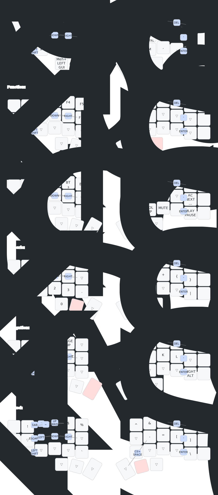

# ImJustinTIme's zmk-config

This is my personal [ZMK Firmware](https://github.com/zmkfirmware/zmk/) configuration.
It consists of a 36-key split chocofi keyboard with colemack and many combos with a focus on programming.

